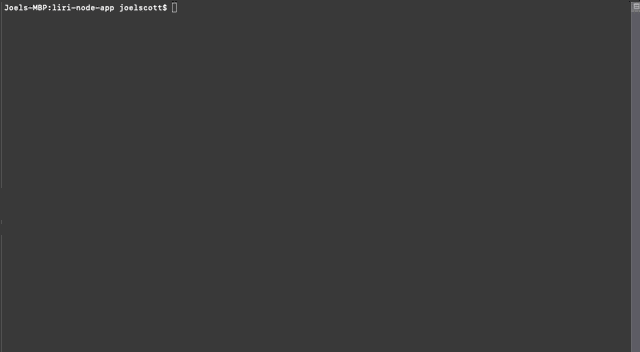
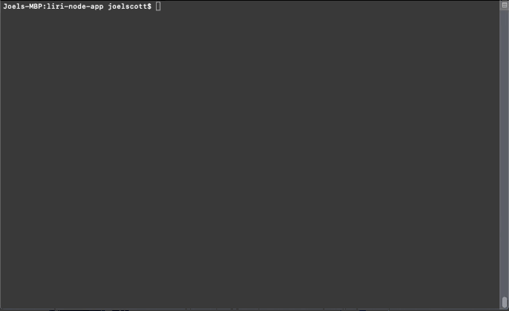

# LIRI Node Application

The liri node app allows users to to find information via the following commands:
- concert-this
- movie-this
- spotify-this-song
- do-what-it-says (command line only)

## Directions: OPTION ONE - Search LIRI using inquirer.js

1. Open the console

2. Navigate to the liri-node-app folder

3. Input: node liri.js 

4. Follow prompts to find concerts, movies, and spotify song names

## Directions: OPTION TWO - Search LIRI by including arguments in node liri.js command line

1. Open the console

2. Navigate to the liri-node-app folder

3. Input: node liri.js + {command} + {search item}

## Concert this demo

## Movie this demo

## Spotify this Song demo

## Do what it says demo

Do what it says will pull whatever command and search term you have stored in the random.txt file

